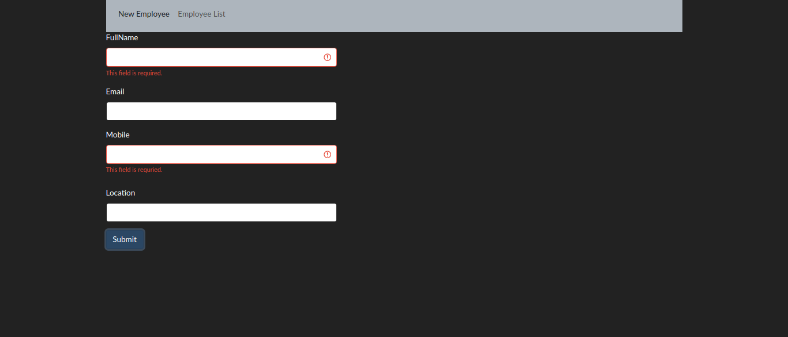
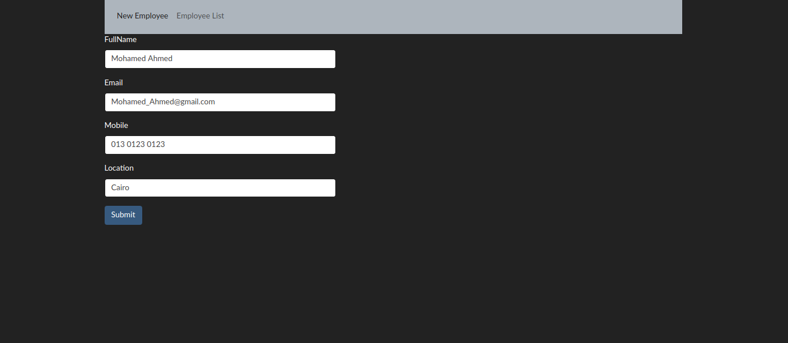
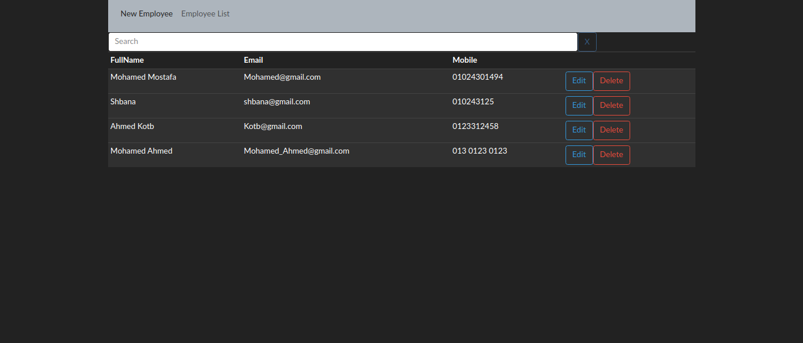

# Introduction to the Angular

Angular is an application design framework and development platform for creating efficient and sophisticated single-page apps. and there is the documentation https://angular.io/docs

## Installation

Run `npm install` to install all the required dependencies

Then run `ng serve` to start a dev server.
Navigate to `http://localhost:4200/`. The app will automatically reload if you change any of the source files

# AngularFire
The official [Angular](https://angular.io/) library for [Firebase](https://firebase.google.com/).

```bash
ng add @angular/fire
npm install firebase angularfire2 --save
```

## What is AngularFire?

- **Observable based** - Use the power of RxJS, Angular, and Firebase.
- **Realtime bindings** - Synchronize data in realtime.
- **Authentication** - Log users in with a variety of providers and monitor authentication state.
- **Offline Data** - Store data offline automatically with AngularFirestore.
- **Server-side Render** - Generate static HTML to boost perceived performance or create static sites.
- **ngrx friendly** - Integrate with ngrx using AngularFire's action based APIs.
- **Manage binary data** - Upload, download, and delete binary files like images, videos, and other blobs.
- **Call server code** - Directly call serverless Cloud Functions with user context automatically passed.
- **Push notifications** - Register and listen for push notifications
- **Modular** - Include only what's needed. No AngularFire package is above 4kb with most under 2kb (gzipped).

## Example use:

```ts
import { Component } from '@angular/core';
import { AngularFirestore } from '@angular/fire/firestore';
import { Observable } from 'rxjs';

@Component({
  selector: 'app-root',
  template: `
  <ul>
    <li *ngFor="let item of items | async">
      {{ item.name }}
    </li>
  </ul>
  `
})
export class MyApp {
  items: Observable<any[]>;
  constructor(firestore: AngularFirestore) {
    this.items = firestore.collection('items').valueChanges();
  }
}
```
# Quick Installation Steps

(https://fireship.io/snippets/install-angularfire/).


# Images

### Home Page



## List Page

### List Page


